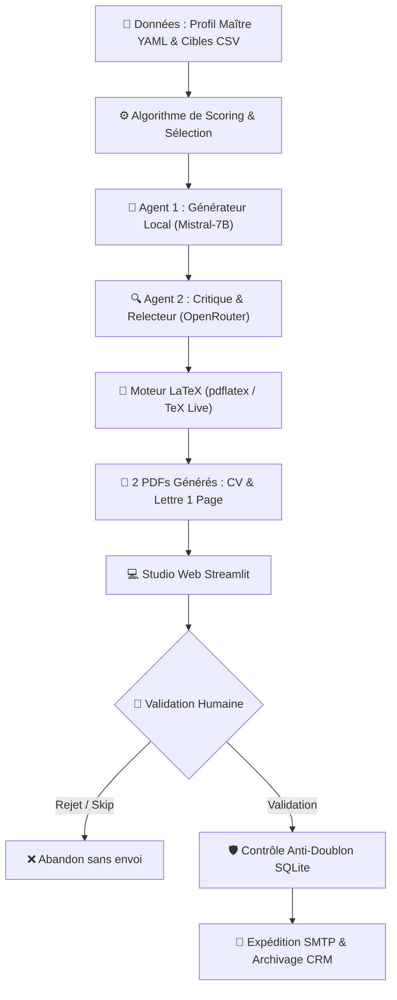

# 🎯 Job Hunter Agent — Autonomous Multi-Agent Job Application Studio

[](https://github.com/ssalmarezgui/job-hunter-agent/actions/workflows/security.yml)
[](https://job-hunter-salma.streamlit.app)
[](https://github.com/gitleaks/gitleaks)
[](https://github.com/PyCQA/bandit)
[](https://github.com/aquasecurity/trivy)
[](https://www.docker.com/)

> **Plateforme autonome d'ingénierie et de génération de candidatures ciblées (CV & Lettres de motivation en LaTeX) propulsée par une architecture d'IA Multi-Agents, une base de données anti-doublon et un pipeline complet de sécurité DevSecOps.**

🔗 **Application déployée en direct (Live URL) :** [https://job-hunter-salma.streamlit.app](https://job-hunter-salma.streamlit.app)

---

## 🏛️ Architecture Système (Pipeline Global)


---

## ✨ Fonctionnalités Majeures

### 1. 🤖 Architecture d'IA Multi-Agents (Actor-Critic Pattern)
* **Agent 1 (Générateur souverain) :** Rédige le premier jet en local via **Mistral-7B (Ollama)** en injectant les projets techniques concrets.
* **Agent 2 (Critique & Éditeur) :** Relecteur d'élite via **OpenRouter (LLM)** qui audite le premier jet, applique les règles d'accord féminin strictes (*élève ingénieure, présidente, candidate*), élimine tout placeholder parasite et affine la cadence des phrases.

### 2. 📄 Moteur Documentaire Polymorphe (LaTeX / TeX Live)
* **Génération de CV sur-mesure :** Sélectionne dynamiquement les 3 projets les plus pertinents parmi le catalogue exhaustif selon le domaine visé (*DevSecOps, Computer Vision, LLM, Data Science*).
* **Calibrage Haute Précision :** Mise en page typographique rigoureuse garantissant un rendu sur **1 seule page stricte**, sans collision de texte et avec puces standardisées.

### 3. 🛡️ Contrôle Métier Anti-Doublon (Base SQLite ACID)
* Indexation unique des adresses e-mails recruteurs dans `data/candidatures.db`.
* Blocage automatique et instantané avant toute génération si l'entreprise a déjà été sollicitée.

### 4. 🚀 Dashboard Web Interactif (Streamlit Studio)
* **Le "CV Studio" :** Cases à cocher interactives permettant à l'utilisateur de choisir ou d'intervertir ses projets en temps réel.
* **Édition à chaud :** Zones de texte éditables directement dans le navigateur avant la compilation.
* **Double visionneuse PDF :** Prévisualisation des deux documents côte à côte.
* **Tracker CRM :** Suivi en temps réel des statuts d'expédition.

---

## 🔒 Volet DevSecOps & Sécurité Applicative

Le projet intègre une approche de sécurité **Shift-Left** rigoureuse tout au long du cycle de développement :

| Mesure de Sécurité | Outil / Standard | Rôle & Résultat |
| :--- | :--- | :--- |
| **Secret Scanning (Local)** | **Gitleaks** | Hook Git `pre-commit` bloquant tout commit contenant un token JWT ou mot de passe. *(0 leak)* |
| **Secret Scanning (Cloud)** | **GitHub Actions** | Workflow CI/CD scannant chaque push avec génération de rapport SARIF. *(Passed)* |
| **SAST (Code Python)** | **Bandit (PyCQA)** | Analyse statique de l'AST Python. Résolution des CWE-400 (timeouts) et triage des faux positifs (`# nosec`). *(Total issues: 0)* |
| **Container Hardening** | **Docker** | Exécution sous un utilisateur non-root dédié (`appuser`, UID 1001) respectant le **Principe du Moindre Privilège (PoLP)**. |
| **SCA / CVE Scanning** | **Trivy (Aqua Security)** | Scan de l'image de base Debian-Slim et des dépendances pip. *(0 vulnérabilité OS)* |
| **Web Access Control** | **Cryptographic Guard** | Authentification web protégée contre les attaques temporelles via `secrets.compare_digest()` (CWE-208). |

---

## 🛠️ Stack Technique

* **Langage & Core :** Python 3.11+, Jinja2, Pydantic, PyYAML, SQLite3.
* **Moteur Documentaire :** LaTeX, TeX Live (`pdflatex`).
* **Intelligence Artificielle :** Ollama (Mistral-7B local), OpenRouter API.
* **Interface Utilisateur :** Streamlit.
* **Infrastructure & CI/CD :** Docker, Docker Compose, GitHub Actions, Streamlit Community Cloud (GitOps).
* **Sécurité :** Gitleaks, Bandit, Trivy.
---

## 🚀 Démarrage Rapide (Getting Started)

### Option 1 : Avec Docker Compose (Recommandé)
```bash
# 1. Cloner le repository
git clone https://github.com/ssalmarezgui/job-hunter-agent.git
cd job-hunter-agent

# 2. Configurer vos variables d'environnement dans .env
# ADMIN_USER, ADMIN_PASSWORD, OPENROUTER_API_KEY, MODE_SIMULATION

# 3. Lancer l'application conteneurisée
docker compose up -d

# Accéder au Studio sur : http://localhost:8501
```

### Option 2 : En Environnement Python Natif
```bash
# 1. Création et activation de l'environnement virtuel
python -m venv venv
source venv/bin/activate  # Sur Windows : venv\Scripts\activate

# 2. Installation des dépendances
pip install -r requirements.txt

# 3. Lancement de l'interface
streamlit run app.py

```
---

## 📁 Structure du Répertoire
```text
job-hunter-agent/
├── .github/workflows/
│   └── security.yml          # Pipeline CI/CD GitHub Actions (Gitleaks, Bandit, Trivy)
├── config/
│   └── settings.py           # Configuration et chargement des variables
├── data/
│   ├── candidatures.db       # Registre transactionnel SQLite (Anti-doublon)
│   ├── entreprises.csv       # Base de prospection et cibles
│   ├── profile_maitre.yaml   # Réservoir exhaustif de compétences
│   └── output/               # Dossier de sortie des PDFs générés
├── src/
│   ├── database.py           # Gestionnaire SQLite et contrôle d'unicité
│   ├── latex_engine.py       # Moteur de rendu LaTeX sécurisé
│   ├── loader.py             # Algorithme de scoring de pertinence
│   ├── mailer.py             # Facteur SMTP avec gestion des pièces jointes
│   ├── ollama_client.py      # Agent 1 : Générateur créatif local (Mistral)
│   └── openrouter_client.py  # Agent 2 : Critique & Relecteur (OpenRouter)
├── templates/
│   ├── cv_template.tex       # Modèle de CV LaTeX dynamique (1 page stricte)
│   └── lettre_template.tex   # Modèle de lettre de motivation LaTeX
├── .dockerignore             # Fichiers exclus du build context Docker
├── .gitignore                # Exclusion stricte des secrets et caches
├── .pre-commit-config.yaml   # Hook Git local de sécurité Gitleaks
├── app.py                    # Dashboard Web interactif Streamlit
├── Dockerfile                # Image conteneurisée durcie Non-Root
├── docker-compose.yml        # Orchestration avec volumes et réseau hôte
├── packages.txt              # Dépendances TeX Live pour le Cloud
└── requirements.txt          # Dépendances Python

```
---

## 👤 Auteure & Contact

**Salma REZGUI**  
*Élève Ingénieure en Informatique*  
**École Nationale des Sciences de l'Informatique (ENSI)** — Tunisie  
*Ancienne Présidente du Club Happiness ENSI (2025 – 2026)*  

* 💼 **LinkedIn :** [linkedin.com/in/salma-rezgui](https://linkedin.com/in/salma-rezgui)
* 🐙 **GitHub :** [github.com/ssalmarezgui](https://github.com/ssalmarezgui)
* 📧 **Email :** [salma.rezgui@ensi-uma.tn](mailto:salma.rezgui@ensi-uma.tn)
